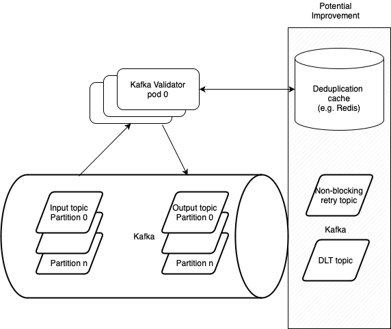

# Project Title
Kafka validator

## Architecture Diagram

## Description

This project is a Kafka message processing application. 
It is a simple application that reads messages from a Kafka topic, validates them, set status and writes the results to another Kafka topic.
It uses Spring transactions to ensure that the in case of an error, the message from the input topic won't be lost.

## Scalability

The application is designed to be scalable. It can be scaled horizontally by running multiple instances of the application. 
Each instance will read messages from the same input topic and write the results to the same output topic. The messages will be distributed among the instances using Kafka's partitioning mechanism.
In case of increased load, more partitions can be added to the input topic and the application can be scaled by adding more instances proportionally.

## Error Handling

The application is designed to handle errors gracefully. In case of an error, e.g. an invalid message,
the application will log the error and continue processing the next message. In case of partial failure of kafka, the application will not stop processing messages.

## Potential Improvements

- Add deduplication logic to avoid processing duplicate messages. This can be done by keeping track of the processed messages in a database or cache.
- Add monitoring and alerting to the application to detect issues or to scale the application based on the load.
- Add dead letter topic to handle messages that cannot be processed after a certain number of retries.
- Add retry topic to handle messages way that failed to process in non-blocking way.

### Prerequisites

- Java 21 or higher
- Docker
- Docker Compose

### Technologies
- Java 21
- Spring Boot 3
- Gradle
- Kafka
- Docker

### Setup

1. Clone the repository:
2. Navigate to the project directory:
3. Build the project using Gradle:
run `./gradlew bootJar`
4. Start the Kafka cluster:
run `docker-compose up -d`
5. Start the application:
run `java -jar build/libs/kafka-validator-0.0.1-SNAPSHOT.jar`